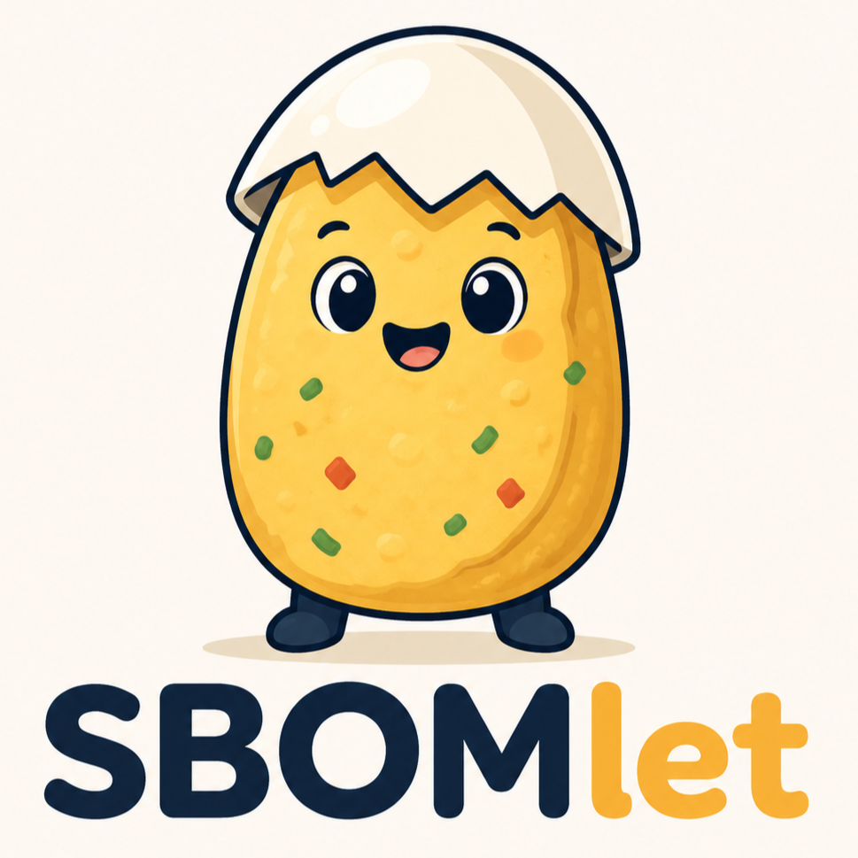

<p align="center">
  
</p>

<h1 align="center">SBOMlet</h1>

<p align="center">
  A third-party licence inventory and CI gate for any repository.
</p>

---

A repository's dependencies each come under their own licence, and that list is
easy to lose track of — until someone needs it for compliance, or an unwanted
licence slips in without anyone noticing. SBOMlet builds the list and checks it.
Point it at a repository and it inventories every dependency and its licence,
writes the attribution files you redistribute, and runs as a CI gate that fails
the build when a licence breaks your policy.

It covers JS/TS, Python, Terraform/OpenTofu, and the OS packages in your Docker
base images. It has no dependency on the project it audits — you add it as one
directory and one policy file.

## What you get

`generate` reads your lockfiles and writes:

- **`THIRD_PARTY_LICENSES.md`** — the inventory: every package, version, licence,
  and where it's used.
- **`THIRD_PARTY_NOTICES.md`** — the verbatim licence texts you redistribute.
- **A [CycloneDX](docs/glossary.md#cyclonedx) SBOM** (optional), if something
  downstream consumes one.

The inventory looks like this:

```markdown
# Third-Party Licenses

**Package counts:**
- Total packages: 1,284
- Production packages: 951
- Unknown license: 0

## Production dependencies

| Name | Ecosystem | Version | License | Used in |
| --- | --- | --- | --- | --- |
| react | npm | 19.2.0 | MIT | apps/web |
| cryptography | pypi | 44.0.1 | Apache-2.0 OR BSD-3-Clause | services/api |
| hashicorp/aws | terraform | 5.92.0 | MPL-2.0 | infra |
```

## The gate

`check` regenerates the inventory offline, byte-compares it against the committed
copy so it can't drift, and evaluates your `policy.toml`. A clean run:

```console
$ task sbomlet:check
policy: 0 fail, 0 warn, 0 suppressed, 1284 ok (1284 verdicts)
```

A dependency the policy forbids fails the run, which exits non-zero so CI stops:

```console
$ task sbomlet:check
policy: 1 fail, 0 warn, 0 suppressed, 1283 ok (1284 verdicts)
policy fail: pkg:npm/some-agpl-tool@2.1.0 in services/api — deny: AGPL-3.0 is denied outside a copyleft-distributed workspace
```

## How it works

1. **Point.** SBOMlet walks the repo for the places dependencies are declared:
   `yarn.lock`, `package-lock.json`, `pnpm-lock.yaml`, `bun.lock`, `poetry.lock`,
   `uv.lock`, `.terraform.lock.hcl`.
2. **Read.** Each is read by a pinned standard generator
   ([cdxgen](https://github.com/CycloneDX/cdxgen),
   [syft](https://github.com/anchore/syft)) or a small in-house parser, and the
   results merge into one inventory keyed by [package URL](docs/glossary.md#purl).
3. **Gate.** Your `policy.toml` decides what's allowed; `check` fails on the first
   violation.

When a licence is ambiguous, SBOMlet records it as `unknown` rather than guessing
— see [honest residual](docs/explanation/design-principles.md).

## Quickstart

You need [mise](https://mise.jdx.dev), which resolves the pinned toolchain, and
[Task](https://taskfile.dev) v3. Add SBOMlet to your repository — a git submodule
or a vendored copy under, say, `tools/sbomlet` — then include its Taskfile from
your root `Taskfile.yml`:

```yaml
includes:
  sbomlet:
    taskfile: ./tools/sbomlet/Taskfile.yml
    dir: ./tools/sbomlet
```

Copy [`policy.example.toml`](policy.example.toml) to `policy.toml`, then:

```sh
task sbomlet:generate POLICY=policy.toml   # write the inventory
task sbomlet:check    POLICY=policy.toml   # run the gate
```

Commit the generated `THIRD_PARTY_*.md` and `enrichment-cache.json`, then run
`task sbomlet:check` in CI. The full walkthrough — install, first run, reading the
output, wiring CI — is in [getting-started](docs/getting-started.md). For a real
configured example, see
[`examples/crt25-collimator-policy.toml`](examples/crt25-collimator-policy.toml).

## GitHub Action

For one-line CI, use the composite action instead of wiring the Taskfile yourself —
it sets up the toolchain, installs SBOMlet, and runs the gate against your checkout:

```yaml
# .github/workflows/licences.yml
on: [push, pull_request]
jobs:
  licences:
    runs-on: ubuntu-latest
    steps:
      - uses: actions/checkout@v6
      - uses: Anansi-Solutions/SBOMlet@main # pin a tag or SHA in production
        with:
          policy: policy.toml
```

Pass `mode: generate` to write the inventory instead of gating it. The action runs
the same `mise + bun` pipeline as the Taskfile path — pick whichever fits your CI.

## Supported ecosystems

| Ecosystem | Read from |
| --- | --- |
| JS / TypeScript | `yarn.lock`, `package-lock.json`, `pnpm-lock.yaml`, `bun.lock` |
| Python | `poetry.lock`, `uv.lock` |
| Terraform / OpenTofu | `.terraform.lock.hcl` |
| Docker base images (OS packages) | a committed `docker-os-sbom.json` (see below) |

Discovery walks the repository and hands each [target](docs/glossary.md#target) to
its [collector](docs/glossary.md#collector). The per-ecosystem detail — which
generator runs, what it reports, and where
[dependency provenance](docs/glossary.md#dependency-provenance) is available — is
in the [CLI reference](docs/reference/cli.md).

## Documentation

Start with getting-started for a first run. Reach for a how-to guide when you have
a specific task, and an explanation when you want to know why SBOMlet is shaped the
way it is.

| Read this if you want to… | Page |
| --- | --- |
| Install SBOMlet and get a first inventory and a passing gate | [getting-started](docs/getting-started.md) |
| Look up a command, flag, exit code, or the `policy.toml` schema | [CLI reference](docs/reference/cli.md) |
| Write a `policy.toml` — add a `[[deny]]` rule, clarify an imprecise licence | [writing-policy](docs/guides/writing-policy.md) |
| Understand the determinism, honest-residual, and safety properties | [design-principles](docs/explanation/design-principles.md) |
| See the module layout and the collector registry | [architecture](docs/explanation/architecture.md) |
| Follow the discover → merge → enrich → normalize → evaluate → render pipeline | [data-flow](docs/explanation/data-flow.md) |
| Know the canonical model — `PackageEntry`, `LicenseFinding`, `Verdict` | [data-model](docs/explanation/data-model.md) |
| Find the reasoning behind a specific design choice | [ADRs](docs/explanation/adr/) |

## Good to know

- **Docker OS packages** aren't discovered from lockfiles. A maintainer runs
  `generate-docker-sbom` once to produce a committed `docker-os-sbom.json`, and
  `generate`/`check` merge it in. It's the only subcommand that talks to a Docker
  daemon or registry; `generate` and `check` never do.
- **The network.** `generate` reaches out only to fill a gap a cold cache can't
  answer — a registry lookup for an otherwise-unknown licence. Once
  `enrichment-cache.json` is committed it serves every claim, and `check` never
  goes online. To re-validate the warm cache against upstream before a release,
  run `task sbomlet:verify-cache`.
- **Line endings.** SBOMlet writes LF-only bytes so `check` can byte-compare. On
  Windows, pin the committed outputs to LF in your `.gitattributes`, or `check`
  reads them as permanently stale:

```gitattributes
THIRD_PARTY_LICENSES.md text eol=lf
THIRD_PARTY_NOTICES.md  text eol=lf
enrichment-cache.json   text eol=lf
docker-os-sbom.json     text eol=lf
```

---

<p align="center">
  <sub>The <strong>SBOMelette</strong> mascot is by Anansi Solutions, licensed under <a href="https://creativecommons.org/licenses/by/4.0/">Creative Commons Attribution 4.0 (CC BY 4.0)</a>.</sub>
</p>
