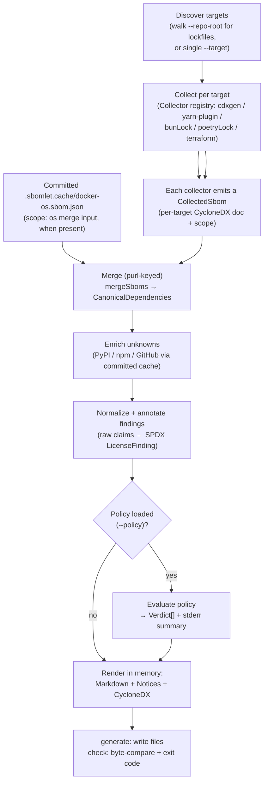
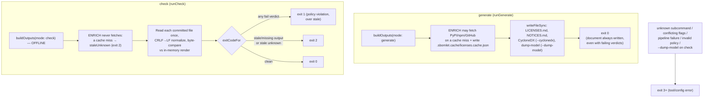

# Architecture

This page is for a [contributor](../style-guide.md) — someone changing the tool
itself. It covers how the tool is put together: the stages it runs, the pieces
that do the work, and the two operating modes (`generate` and the
[gate (`check`)](../glossary.md#the-gate-check)) that share almost all of their
code.

If you want to adopt and run the tool rather than change it, start with the
[`README.md`](../../README.md) and [getting-started](../getting-started.md). The
canonical model is laid out in [data-model](data-model.md), the per-stage flow
in [data-flow](data-flow.md), and the reasoning behind the design in
[design-principles](design-principles.md).

## What the tool does

It produces a complete, legally compliant license inventory for any repository,
across JS/TS, Python, Terraform/OpenTofu, and the operating-system packages
inside Docker base images, and it fails CI when a dependency violates a
[policy](../glossary.md#policy-lanes).

It does not detect licenses itself. That work is left to standard
[generators](../glossary.md#generator): cdxgen, the Yarn-4 CycloneDX plugin,
syft, and tofu. The tool drives those, normalizes their output to
[SPDX](../glossary.md#spdx), merges everything into one model, and renders
deterministic documents. The only in-process parsers exist where no upstream tool
does the job.

There are three subcommands. The CLI parses them with `node:util`'s `parseArgs`
rather than a framework, which keeps the tool's own dependency footprint small.

- **`generate`** runs the full pipeline and writes `THIRD_PARTY_LICENSES.md`, its
  `THIRD_PARTY_NOTICES.md` companion, and the committed
  [enrichment cache](../glossary.md#enrichment-and-the-enrichment-cache) — three
  files for an adopter running only `task generate`. The cache is
  written only when enrichment fetches a new licence, so a warm run that resolves
  every unknown from the committed cache leaves it untouched. With `--cyclonedx`
  it also writes a [CycloneDX](../glossary.md#cyclonedx) 1.6 export, and with
  `--dump-model` a debug model dump that is not committed.
- **`check`** is the CI gate. It re-runs the *same* pipeline entirely offline
  against the committed caches, byte-compares every configured output, evaluates
  the policy, and exits with a code that says which class of thing is wrong. It
  writes nothing.
- **`generate-docker-sbom`** is the only path that touches the Docker daemon or
  syft. It scans Docker base images into a committed `.sbomlet.cache/docker-os.sbom.json`, which
  `generate` and `check` then read as an ordinary merge input. `generate` and
  `check` themselves never produce this file.

All process exit codes live in the CLI module. The tool runs through mise and a
Taskfile (`task generate`, `task check`), and the Taskfile
passes `--base-dir` so that relative artifact paths resolve against the directory
you invoked it from rather than against `tools/sbomlet`.

Source: `src/cli.ts`, `src/pipeline/pipeline.ts`.

## The pipeline

`generate` and `check` share one write-free core. It renders every output in
memory and never calls `writeFileSync`. `generate` holds the only file writes;
`check` byte-compares the in-memory render against the committed files instead.
The stages run in a fixed order:

The order is deliberate at a few points:

- The policy is validated before any scan. An invalid policy aborts in a second
  through the config-error path, rather than after minutes of scanning.
- The committed Docker OS SBOM is threaded in as an `os`-scope input when the
  file exists. A missing file means no OS entries, the offline equivalent of a
  cache miss, not a live scan.
- [Enrichment](../glossary.md#enrichment-and-the-enrichment-cache) runs before
  annotation, so a license claim fetched from a registry flows through the same
  normalizer as a claim from a generator.
- The policy is evaluated only when one was loaded. Without `--policy` the
  documents still render, with normalized license expressions and no verdicts.

Source: `src/pipeline/pipeline.ts`, `src/pipeline/targets.ts`.

### Generate versus check

Both subcommands parse the same flags, so the set of files `check` compares is
exactly the set `generate` would write. The difference is the mode. In `generate`
mode the core may fetch on a cache miss and write the enrichment cache, then write
the documents. `check` forces `check` mode, which never fetches and never writes,
and byte-compares instead.

The exit codes mean:

| Code | Meaning |
| --- | --- |
| `0` | Success, or `check` found everything in order. |
| `1` | `check` found at least one policy `fail` [verdict](../glossary.md#verdict). Warn verdicts and unused-policy-entry warnings print but never gate. |
| `2` | `check` found at least one stale or missing committed output, including a committed-cache miss that would need enrichment ([staleness](../glossary.md#staleness)). |
| `3+` | A tool or config error: unknown subcommand, conflicting flags, a pipeline failure, a coverage assertion, an invalid policy, or `--dump-model` passed to `check`. |

Codes 1 and 2 come from one function, which maps the structured check result to a
code. A thrown exception can never surface as 0, 1, or 2; it propagates to the
CLI's catch and becomes a 3. A violation takes precedence over staleness: any
`fail` verdict returns 1, otherwise any stale file returns 2, otherwise 0.

Two properties make `check` trustworthy. There is no write path on the gate. The
core never writes, and `check` rejects `--dump-model`, so the gate cannot
overwrite the files it is meant to verify. And there is no
time-of-check/time-of-use window: both sides of every comparison come from one
core run, so the in-memory render is what `generate` would write, and nothing
fresh is round-tripped through disk. The committed text is the only side
normalized from CRLF to LF on read, to tolerate an unpinned checkout under
`core.autocrlf=true`. The in-memory render is LF by construction.

Source: `src/gate/check.ts`, `src/cli.ts`.

## Components

### Target discovery

Discovery walks `--repo-root` with a hand-rolled `node:fs` traversal, adding no
new dependency, looking for the lockfiles it knows: `yarn.lock`,
`package-lock.json`, `pnpm-lock.yaml`, `bun.lock`, `poetry.lock`, `uv.lock`, and
`.terraform.lock.hcl`. It skips `node_modules`, `.git`, every leading-dot
directory (which covers `.terraform`, `.yarn`, `.cache`), and the tool's own
directory. Symlinks report as non-directories on the way in, so they are never
followed.

A [target](../glossary.md#target)'s identity is its forward-slash, repo-relative
directory path, and results sort by `(identity, lockfile)` using the single
tool-wide string comparator. Two pure post-steps run over the sorted output. When
several JS lockfiles share a directory, they collapse to one target by the
precedence `bun > pnpm > yarn > npm`, with a warning. A leftover binary
`bun.lockb` with no surviving `bun.lock` warns you to migrate. Discovery itself
writes no stderr; the warnings come back as data, and the pipeline prints them.

Source: `src/targets/discover.ts`, `src/pipeline/targets.ts`.

### The collector registry

Adding a target kind means one registration, not a new branch in a dispatch
switch. The registry is a read-only map from lockfile kind to
[collector](../glossary.md#collector), exhaustive over the known kinds. Each
collector exposes a `tool(lockfileText)` identity — the `name@version` printed in
the per-target `collecting … via …` line — and a `collect(target, ctx)` that
returns a merge-ready `CollectedSbom`. Collectors never write stderr; the
per-target loop owns that line.

| Lockfile kind | Collector | Underlying tool |
| --- | --- | --- |
| `yarn` | `yarnCollector` | Yarn-4 CycloneDX plugin (Yarn ≥4) or cdxgen (Yarn 3 / empty) |
| `npm` | `cdxgenCollector("npm", …)` | cdxgen `-t js` |
| `pnpm` | `cdxgenCollector("pnpm", …)` | cdxgen `-t js` |
| `bun` | `bunCollector` | in-process `bun.lock` parser |
| `poetry` | `poetryCollector` | cdxgen `-t python`, plus `poetry.lock` for scope |
| `uv` | `cdxgenCollector("uv")` | cdxgen `-t python` |
| `terraform` | `terraformCollector` | in-process lock + `modules.json` parser |

A few collectors have behaviour worth knowing before you change them.

Yarn dispatch is driven by lockfile content. The selector reads only the
`__metadata.version` at the head of the lockfile, a regex over the first handful
of lines rather than a YAML parser. Version 8 or higher routes to the Yarn-4
plugin; version 6 (Yarn 3), an empty lockfile, or anything unparseable falls back
to cdxgen. The plugin runs twice, full and `--production`, and the production
[purl](../glossary.md#purl) set decides
[development-only versus production](../glossary.md#development-only-and-production)
scope downstream.

cdxgen handles JS and Python, pinned to a single version and driven through an
argv array that a test locks byte-for-byte. Its raw SBOM lands in a per-run temp
directory and never travels past it. The poetry lane departs from this:
`cdxgen --no-install-deps` emits no group marker, so the collector parses the
lock's own `groups` arrays into the production purl set, threaded in the same way
as the Yarn dual-run path.

bun and Terraform take no subprocess at all. No upstream tool preserves
`bun.lock` identity or resolves Terraform licenses, so both are in-process
parsers, and both ignore the timeout budget. The Terraform collector has its own
section below.

[Dependency provenance](../glossary.md#dependency-provenance), the "Why" a
package is present, is collected here for the lanes that can supply it. The
Yarn-4 plugin lane derives it from the BOM's root-anchored dependency graph; the
poetry lane derives it from `poetry.lock` and `pyproject.toml`. The npm, pnpm,
bun, uv, and Terraform lanes leave provenance absent, and the render layer shows
an honest `—`.

Each collector returns a `CollectedSbom`: the parsed CycloneDX document (treated
as an untrusted shape), the target identity, and optionally a production purl
set, first-party names, scope, and a per-purl provenance map.

Source: `src/collectors/registry.ts`, `src/collectors/dispatch.ts`,
`src/collectors/cdxgen.ts`, `src/collectors/npmProvenance.ts`,
`src/collectors/poetryProvenance.ts`.

### The normalizer

The normalizer turns a raw [license claim](../glossary.md#license-claim) into a
[license finding](../glossary.md#license-finding) that carries its own
provenance. Each claim runs through a fixed sequence: an exact SPDX parse, then
an imprecise-family intercept, a precise-label fixup, a Debian/DEP-5 shorthand
map, a guarded `spdx-correct` fixup, and finally unknown. It relies on
`spdx-expression-parse`, `spdx-correct`, and `spdx-satisfies`. There is no
substring matching anywhere, and hostile or malformed input degrades to an
unknown finding rather than crashing.

The [honest residual](../glossary.md#honest-residual) rule governs the
imprecise-family step. An ambiguous family label — `BSD`, `Apache`, a bare
`GPL`/`AGPL`/`LGPL`, `EUPL` — is one that `spdx-correct` would guess into a
precise id. The normalizer intercepts those and records them as an
[imprecise family](../glossary.md#imprecise-family) instead: present, flagged for
a human to pin down, never a fabricated id. When several claims combine, a
copyleft signal, precise or imprecise, is never discarded by a permissive
sibling.

Annotation attaches a finding to every package and runs the staleness-guarded
override chain: project [`[[clarify]]`](../glossary.md#policy-lanes) rules first,
then the shipped built-in overrides. It also records the audit fields the policy
engine needs: the pre-override expression, so a denied license cannot be licensed
back in by an override, and every observed per-claim expression, so deny can still
see a member that combining collapsed away.

Source: `src/normalize/normalize.ts`.

### The purl-keyed merge

The [merge](../glossary.md#merge) builds one canonical model from any number of
collector outputs, keyed by the purl verbatim, with URL-encoding like `%40` left
intact, never by the bom-ref. The subset of CycloneDX it reads is narrowed by a
shared validation boundary: every unknown field is tolerated and ignored, and a
field that fails to narrow is a skip rather than a throw. The volatile
document-level fields — serial number, metadata timestamp, annotations — are
never declared, so they cannot leak into compared content.

A package shared across workspaces appears once, with every place it is used in
its [occurrences](../glossary.md#occurrence). Two properties govern the fold, and
both protect the gate:

- Occurrences fold prod-wins. An occurrence counts as development-only only if
  every contributing component is dev; one shipped component makes the whole
  occurrence production, because a shipped occurrence carries the distribution
  obligation and must not be masked to dev.
- [Scope](../glossary.md#scope-app-and-os) reconciles app-wins. When the same
  purl turns up in both `app` and `os` scope, the gating `app` scope wins, so a
  shared dependency is not demoted out of the policy gate.

License claims are unioned and deduplicated structurally, and the result is
sorted by the tool-wide package comparator.

Every other module imports its types from the canonical model. The key shapes are
`PackageEntry`, `Occurrence`, `LicenseClaim`, `LicenseFinding`, and `Verdict`.
[data-model](./data-model.md) has the full treatment.

Source: `src/merge/merge.ts`, `src/model/dependencies.ts`,
`src/validate/sbom.ts`.

### Enrichment and the committed cache

[Enrichment](../glossary.md#enrichment-and-the-enrichment-cache) sits between
merge and annotation. It finds every package whose claims resolve to unknown and
tries to fill the gap. Only one of the two modes reaches the network.

In `generate` mode it fetches each unknown from its registry: PyPI's JSON for
`pkg:pypi`, the npm packument for `pkg:npm`, and the GitHub License API for
`pkg:terraform` version-ref candidates. It appends a `registry` claim and records
the result in the committed cache, a positive entry, or a negative entry only on
a clean, empty 200 answer. A fetch failure propagates loudly and writes nothing,
so a transient outage cannot be frozen into the cache as a false negative.

In `check` mode it never fetches and never writes. A cache miss for a package
that still needs enrichment is a stale condition: the purl is reported as a stale
unknown, and the gate maps it to exit 2.

The appended claim flows through the same normalizer as a generator claim, so the
`clarify > registry > generator` precedence holds downstream without extra work.
The cache file is serialized with the tool-wide sorted-key, LF, indent-2
contract. It resolves against `--base-dir`, so for the dogfood run it
lives at the repo root as `.sbomlet.cache/licenses.cache.json`, committed rather than
gitignored, and that is the file `check` reads to regenerate fully offline. The
one write site is gated on `generate` mode, which keeps the core write-free in
either mode.

Source: `src/enrich/enrich.ts`, `src/enrich/cache.ts`.

### The policy engine

The policy engine is a pure producer of [verdicts](../glossary.md#verdict). It
decides; the documents and the gate only read what it decided.

Loading a `.sbomlet.policy.toml` rejects rather than skips. Every semantic problem is
collected into one error that names the offending table path, and every SPDX
pattern, clarify expression, and workspace license is parsed at load time, so
evaluation never meets an unparseable rule. Compatible and deny patterns are
pre-decomposed into allowlists that `spdx-satisfies` can use safely, and any
AND-containing pattern is rejected up front. Suppression paths and `[docker]`
ignore globs must be forward-slash only, with no `..` segments and no leading or
trailing slash. A TOML syntax error propagates from the TOML parser untouched.

Evaluation is a pure fold over the model: one verdict per package-and-occurrence,
sorted by `(purl, occurrenceTarget)`. The same model and policy always produce
the same verdicts. The [policy lanes](../glossary.md#policy-lanes) apply in strict
precedence, highest first:

| Lane | Effect |
| --- | --- |
| **Deny** (terminal) | Force-fail. Checks the combined expression, the pre-override expression, *and* every per-claim observed expression against the deny list. License matching is OR-election over the union of all deny allowlists (so `BUSL-1.1 OR SSPL-1.0` is denied while `MIT OR BUSL-1.1` is not); name matching is an exact package name, for non-SPDX riders like Commons-Clause. |
| **Stale override** | An override whose precondition no longer matches fails the gate loudly; the assertion is never applied. |
| **Compatible, `match="package"`** | Exact name, and exact version when pinned → `ok`. |
| **Compatible, `match="license"`** | Satisfies the validated allowlist → `ok`. |
| **Workspace copyleft suppression** | A copyleft finding under a suppressed path is suppressed *only* when the workspace's own declared license absorbs it. A path match alone is never enough. |
| **Defaults** | Copyleft → `fail`; unknown → whatever `policy.unknownHandling` says; imprecise → a non-gating `warn`; otherwise `ok`. |

Deny sits above everything, including the accept lanes and the stale-override
lane. A use-restricted or [source-available](../glossary.md#source-available)
license cannot be licensed back in by a compatible rule, a workspace suppression,
a scope downgrade, or any override.

Two scope knobs downgrade would-be-fail verdicts, and only those, composed
os-then-dev. `[dev_dependencies]` (`warn`/`fail`/`ignore`) downgrades a dev-only
occurrence, but a production occurrence always fails, the prod-wins property
again. `[os_dependencies]` downgrades a package whose scope is `os`, but a denied
OS package still fails, because deny is terminal above the downgrade.

The engine also reports compatible and clarify entries that never decided
anything, as stale-policy hygiene. Those warnings print but never gate.

Source: `src/policy/schema.ts`, `src/policy/evaluate.ts`,
`src/policy/denylist.ts`.

### The renderers

Every renderer is a pure function: model in, exact LF bytes out. They assemble
output with `"\n"` literals rather than the platform line-ending constant, sort
their keys, and emit no timestamps. They are consumers of the
[verdicts](../glossary.md#verdict); a renderer never evaluates policy.

The Markdown document is the main output. Its header carries the regenerate
command in place of a date, and on a policy run its section order is fixed: the
H1 title (the `[document].title` from the policy, or the default), the dateless
auto-generated header comment, the optional `[document].preamble` paragraph, the
`Copyleft notice rules are configured in <policy>.` pointer line, the
package-counts block (with a per-ecosystem column), the *Problematic licenses*
roll-up (a blocking table of fail verdicts plus a non-blocking warn summary), the
*Copyleft and special notices* section (a one-line summary sentence, then the
suppressed-workspaces list when any, then the table), the *Imprecise licenses*
review section when any package is imprecise, and finally the summary tables
split into Production, Development-only, and Docker base-image OS. The copyleft
and problematic tables carry a `Why` provenance column; the three summary tables
carry Name, Ecosystem, Version, License, and Used in. Every value interpolated
from SBOM data or the policy file routes through one cell-escaping function, a
Markdown-injection mitigation that escapes pipes, backticks, and brackets,
neutralizes inline HTML, and collapses line breaks. The `Why` cell is computed
from the same occurrence subset the `Used in` cell names, so a row never borrows
a path or introducer from an out-of-scope occurrence, and it renders an honest
`—` when nothing is computable.

The notices companion renders per-package attribution — copyright lines, NOTICE
contents, and verbatim texts for the population SPDX cannot describe — plus a
canonical license-text appendix keyed by referenced SPDX id. Each canonical entry
is marked as canonical text so a fallback gap is auditable, and any multi-line
untrusted block renders inside a fence longer than the longest backtick run in
its content.

The CycloneDX 1.6 export is hand-rolled against the 1.6 schema. It carries no
serial number and no metadata timestamp, which makes it both deterministic and
schema-valid by construction. Components are sorted by purl, and a single
`JSON.stringify` is the only encoder.

Source: `src/render/markdown.ts`, `src/render/notices.ts`,
`src/render/cyclonedx.ts`.

### The gate

The gate relies on the core being byte-deterministic, so a `check` mismatch is
always a real [staleness](../glossary.md#staleness), not noise. Its mechanics,
the byte comparison and the violation-over-stale exit mapping, are covered under
[Generate versus check](#generate-versus-check) above.

Source: `src/gate/check.ts`.

## The Docker consumer model

Everyday `generate` and `check` stay daemon-free and fully offline. The Docker
side-effect is confined to one subcommand.

`generate-docker-sbom` is the only path that touches the Docker daemon or syft.
The scanner is pinned to a single version, mirrored in `mise.toml`. It scans each
image into a temp file, keeps only the `pkg:deb` and `pkg:apk` components that
carry a name, version, and purl, and records each image's platform RepoDigest via
`docker inspect`, not the manifest-list digest. The arguments are passed as an
argv array with the image operand last, behind an end-of-options separator, so
command injection is impossible by construction. The emitted document is a
minimal, deterministic shape serialized with the tool-wide sorted-JSON contract,
so scanning the same images twice produces byte-identical output.

syft is deliberately not a registered collector. The gate runs the collector loop
on the check path, and a registered Docker collector would therefore force a
daemon onto every CI check. Keeping it generate-only and outside the registry
lets `check` stay offline. Its output is consumed instead as a committed merge
input.

That committed `.sbomlet.cache/docker-os.sbom.json` is the contract surface between the two
worlds. The pipeline reads it as an `os`-scope input when it exists, size-gated
before any read; a missing file means no OS entries, the offline cache-miss
equivalent rather than a live scan. `generate` and `check` read the same
committed bytes, so determinism follows. The OS packages route through the
`[os_dependencies]` policy lane and render in their own Docker base-image
section, where [scope](../glossary.md#scope-app-and-os) lets the policy treat
them differently: base-image GPL is expected, not a violation.

`generate-docker-sbom` has three mutually exclusive modes:

| Mode | What it does |
| --- | --- |
| `--image <ref>…` | Live syft scan of an explicit image set; needs a daemon. With no images it defaults to a documented default image set that lives in the dogfood layer rather than core, to keep the tool independent of any one project. |
| `--repo-root <dir>` | Discovery. Walks the repo for Dockerfiles, derives each shipped `FROM` base, and scans the resolved bases (unioned with any explicit `--image`). |
| `--from-sbom <path>…` | Ingests pre-made syft/CycloneDX SBOMs with no Docker and no network, the CI-attestation consumer. |

Source: `src/pipeline/dockerSbom.ts`, `src/collectors/dockerOs.ts`,
`src/cli.ts`.

### Dockerfile discovery and base derivation

Discovery mode is a pure, daemon-free computation. It walks the repo using the
same directory-exclusion predicate as lockfile discovery, reused by reference so
the two cannot drift, then applies `--exclude` globs, then the `[docker]` ignore
globs. For each Dockerfile it resolves the shipped (last) stage's `FROM`: it
strips `--platform`, substitutes global `ARG` defaults to a fixpoint, follows
stage aliases under a cycle guard, and produces a base that is one of `image`,
`scratch`, or `unresolved`.

It does not guess. An ARG it cannot resolve, a leftover `${…}`, or a malformed ref
yields `unresolved` with a reason, a loud-skip
[honest residual](../glossary.md#honest-residual) rather than a wrong base. The
scan set is the union of every resolved `image` base and any explicit `--image`,
deduped and sorted; a `scratch`, unresolved, or ignored Dockerfile contributes
nothing.

One scope limit is worth stating: discovery derives the base image's OS packages,
not the Dockerfile's own `RUN apt/apk install` steps. Capturing those requires
building the image, which is the `--image` or `--from-sbom` path.

Source: `src/pipeline/dockerSbom.ts`, `src/collectors/dockerfile.ts`.

## The Terraform `.terraform/`-signal gate

No upstream tool resolves Terraform or OpenTofu provider and module licenses;
`cdxgen -t terraform` emits components with no licenses at all. The Terraform
collector is therefore a deliberate in-process exception. It parses two trusted,
materialized artifacts: the providers from `.terraform.lock.hcl` (a regex over
`provider` blocks, yielding the exact lock-pinned version) and the external
registry modules from `.terraform/modules/modules.json`. It emits the same
minimal CycloneDX document every other collector produces, and defers license
resolution to the GitHub resolver in the enrich stage.

The hard part is knowing whether `tofu init` has run. That check is the design's
most-iterated decision, and the answer is a filesystem signal rather than an HCL
lexer. Four consecutive adversarial reviews each found another valid-HCL shape
that a hand-rolled lexer mis-tokenized into a silently dropped module. The
resolution was to stop lexing. The whole `.terraform/` directory is gitignored
and absent until `tofu init` or `tofu get` materializes it, and tofu writes
`.terraform/modules/modules.json` as soon as it processes any module call. So the
gate reads the filesystem:

- `modules.json` present as a regular file → read the external modules (the
  authoritative path; a directory named `modules.json` is treated as absent and
  routed to the gate, never surfaced as a raw `EISDIR`).
- `modules.json` absent, but `.terraform/providers/` is a directory and
  `.terraform/modules/` does not exist → init ran with no module calls →
  collect providers from the committed lock. Never a throw.
- any other absent-`modules.json` shape → fail loud, telling the user to run
  `tofu init` or `tofu get` first.

This removed the hand-rolled HCL lexer, and the class of decoy and
mis-tokenization bugs went with it. One residual window remains, a `.tf` edited
to add a module call without re-running init, and it is documented and delegated
to `tofu plan`/`validate`/`get` in CI.

Source: `src/collectors/terraform.ts`.

## Design principles, and where they live

These run throughout the code; [design-principles](./design-principles.md)
treats each one in full.

1. **Determinism.** The gate depends on it. LF-only output, sorted keys, no
   timestamps, the regenerate command in the header in place of a date, and a
   byte-identical double-generate. One string comparator is used everywhere,
   chosen over locale-aware comparison because locale comparison is ICU-dependent
   and would break byte-identity across platforms, and every JSON artifact shares
   one serializer.
2. **Minimal dependencies, standard tools orchestrated.** cdxgen, the Yarn-4
   plugin, syft, and tofu are pinned CLIs driven through argv arrays; the CLI uses
   `node:util`'s `parseArgs`; discovery is a hand-rolled `node:fs` walk; and the
   only in-process parsers exist where no upstream tool does the job: bun,
   Terraform, and Dockerfile base derivation.
3. **Honest residual.** When something cannot be computed precisely, render `—` or
   fail loud rather than fabricate. Imprecise license families are surfaced
   rather than guessed, the Terraform gate keys on the filesystem instead of
   lexing HCL, Dockerfile base derivation emits `unresolved` in place of a wrong
   base, and provenance shows an honest `—` when it is not root-reachable.
4. **Safety properties, hardened by adversarial review.** A shipped copyleft or
   source-available license must never silently pass the gate. Deny is terminal,
   a production occurrence always fails, and the merge folds prod-wins. Several of
   these guards — the deny-over-overrides terminal, the union license-deny
   election, the Terraform filesystem gate, the provenance scoping — were hardened
   across multiple rounds of multi-lens review.
5. **Standards.** SPDX identifiers throughout, via `spdx-expression-parse`,
   `spdx-correct`, and `spdx-satisfies`, and CycloneDX 1.6 as the SBOM
   interchange format for both collector inputs and the rendered export.

Source: `src/model/dependencies.ts`, `src/normalize/normalize.ts`,
`src/collectors/terraform.ts`, `src/policy/evaluate.ts`, `src/merge/merge.ts`.
