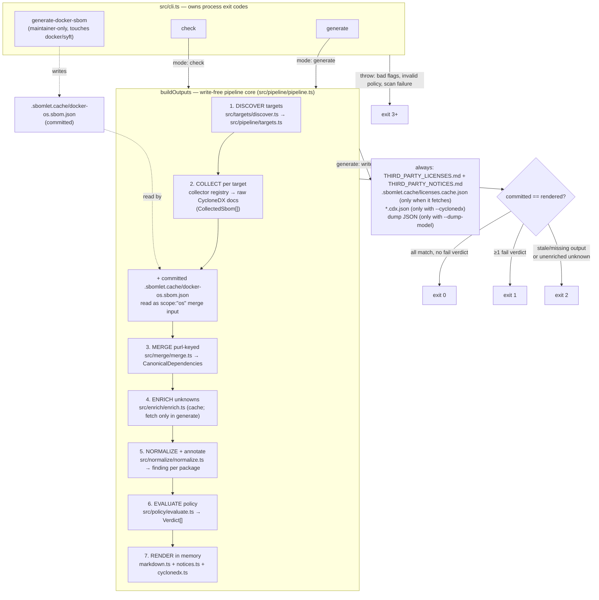

# Data flow

This page is for a contributor, someone changing the tool itself. It follows one
dependency from a raw lockfile entry to a rendered table row and a CI exit code,
names the transformation each stage performs, and explains why the chain stays
deterministic enough to be byte-compared as a gate.

For the module map, see [`architecture.md`](architecture.md); for the shape of
each in-flight type, [`data-model.md`](data-model.md); for the design rules the
flow upholds, [`design-principles.md`](design-principles.md). To run the
commands rather than read about them, see [`getting-started.md`](../getting-started.md)
and the [README](../../README.md). Domain terms link to the
[glossary](../glossary.md) on first use.

## One pipeline, two ends

`generate` and [`check`](../glossary.md#the-gate-check)
run the same pipeline core, `buildOutputs`. That core renders every output as a
string in memory and never writes a file. The two commands differ only at the
ends. `generate` takes the rendered strings and writes them to disk. `check`
reads the committed files and byte-compares them against the same in-memory
strings, writing nothing.

The write lives in the command, not the core, and that is what makes the gate
trustworthy. Both sides of a `check` comparison come from one `buildOutputs`
call, so the in-memory string is exactly what `generate` would write. There is
no regenerate-then-compare window in which the two could drift, and `check` can
never overwrite the file it is gating on.

Source: `pipeline/pipeline.ts` (`buildOutputs`, `runGenerate`), `gate/check.ts`.



## The stages

Each stage takes the previous stage's product and rewrites it. The table below
lists the stages; the sections after it walk each row.

| Stage | Input | Output | Module |
| --- | --- | --- | --- |
| Discover | repo root | sorted `DiscoveredTarget[]` | `targets/discover.ts` |
| Collect | one target | raw CycloneDX (`CollectedSbom`) | `collectors/` via `registry.ts` |
| Merge | `CollectedSbom[]` | `CanonicalDependencies` | `merge/merge.ts` |
| Enrich | model + committed cache | model with registry claims appended | `enrich/enrich.ts` |
| Normalize | claims per package | a `LicenseFinding` per package | `normalize/normalize.ts` |
| Evaluate | annotated model + policy | `Verdict[]` (per package × occurrence) | `policy/evaluate.ts` |
| Render | annotated model + verdicts | Markdown / notices / CycloneDX bytes | `render/` |

### Discover

The default mode walks the repository root and emits one
[`DiscoveredTarget`](../glossary.md#target) per recognized lockfile. The
recognized set is a closed list — `yarn.lock`, `package-lock.json`,
`pnpm-lock.yaml`, `bun.lock`, `poetry.lock`, `uv.lock`, `.terraform.lock.hcl` —
each mapped to one ecosystem. When several JS lockfiles sit in the same
directory, a fixed precedence (`bun > pnpm > yarn > npm`) picks one. Single-target
mode (`--target`) wraps one resolved directory as a yarn target so it flows
through the identical loop.

Targets are scanned sequentially in sorted identity order. This is the first
thing the determinism contract depends on: the order in which targets feed the
[merge](../glossary.md#merge) is fixed before any file is read.

Source: `targets/discover.ts`, `pipeline/targets.ts`.

### Collect

The loop dispatches each target through the
[collector](../glossary.md#collector) registry, a map from lockfile kind to
collector. Adding an ecosystem is one registration, never a new branch in the
loop. Each collector drives a standard
[generator](../glossary.md#generator), or parses the lockfile in process, and
returns a [CycloneDX](../glossary.md#cyclonedx) document. The tool does not
produce license data of its own; it runs the tools that produce it.

The registry holds the per-ecosystem choices:

| Kind | What runs |
| --- | --- |
| yarn | A Yarn 4+ lockfile uses the dual-run yarn-plugin-cyclonedx adapter (a full SBOM plus a `--production` SBOM); an older, empty, or unparseable lockfile falls back to cdxgen. |
| npm, pnpm, uv | cdxgen. |
| bun | An in-process `bun.lock` parser — no upstream generator preserves `bun.lock` identity. |
| poetry | cdxgen for the inventory, with dev/prod scope derived from the `poetry.lock` group arrays because cdxgen emits no poetry group markers. |
| terraform | An in-process collector reading `.terraform/modules/modules.json`. |

Each collector returns a `CollectedSbom`: the raw parsed CycloneDX document
(treated as an untrusted shape), a forward-slash target identity, and optional
per-target signals. The signals are the production-purl set from the dual run,
the workspace member names to drop, the scope, and the per-purl
[dependency-provenance](../glossary.md#dependency-provenance) map.

That provenance map is the exception to know about. Only two lanes carry a graph
complete enough to populate it: the Yarn 4+ plugin lane, whose BOM is a
root-anchored dependency graph, and the poetry lane, which has `poetry.lock`
plus `pyproject.toml`. The cdxgen npm lane is not one of them; it emits no such
graph, so its packages show "—" in the "Why" column rather than an
[introducer](../glossary.md#dependency-provenance) chain. Every other source
leaves provenance absent.

The loop owns the `collecting <id> via <name>@<version>` line on stderr;
collectors never write stderr themselves. It also owns the coverage decision,
the one place that decides a lockfile has nothing to inventory. The distinction
it draws is deliberate. A legitimately empty lockfile (whitespace only, a
workspace-only `yarn.lock`, a `poetry.lock` with no package tables) is
skip-classified: the loop warns loudly and moves on. A non-empty lockfile that
nonetheless scans to zero components is the genuinely broken case, and it fails
loudly with a thrown coverage assertion (exit 3) rather than degrading to a quiet
skip that would hide an incomplete inventory.

After the collect loop, `buildOutputs` reads the committed `.sbomlet.cache/docker-os.sbom.json`,
if present, as a [scope `os`](../glossary.md#scope-app-and-os) merge input. This file
is never scanned per run. It is produced separately by the maintainer-only
`generate-docker-sbom` subcommand, the only path in the tool that touches a
docker daemon or syft. A missing file is the offline cache-miss equivalent: no
`os` entries, no docker, no syft. When the file is present it is size-gated
before any read, as a bound against a hostile committed artifact.

Source: `collectors/registry.ts`, `pipeline/targets.ts`, `pipeline/coverage.ts`
(`coverageSkipReason`, `classifyCoverage`), `pipeline/pipeline.ts`
(`readCommittedDockerOsSbom`).

### Merge

`mergeSboms` folds every `CollectedSbom` into one
[`CanonicalDependencies`](../glossary.md#package-entry), keyed by
[purl](../glossary.md#purl) verbatim, with URL-encoding intact, never the
`bom-ref`. The consumed subset of each component is narrowed by an arktype
boundary, and a malformed component is skipped rather than thrown on. That is the
same skip-rather-than-throw handling the tool uses everywhere it reads
third-party data.

For each surviving component it produces a
[`PackageEntry`](../glossary.md#package-entry) carrying the purl, name, version,
[occurrences](../glossary.md#occurrence), raw
[license claims](../glossary.md#license-claim), and scope. Four transformations
happen here:

- License claims read all three CycloneDX license shapes (expression, SPDX id,
  name) into claims tagged `source: "generator"`. Nothing is normalized yet;
  claims stay raw.
- Scope is decided per occurrence. When a production-purl set exists (the
  yarn-plugin or poetry lanes), membership in it is authoritative; otherwise
  cdxgen's property markers decide, with a guard so an optional-but-shipped
  binary does not vanish into the dev column.
- Occurrences record one entry per consuming target.
- The first-party skip keeps workspace and portal members out of the inventory,
  but only when both a name match and a second structural signal hold, so a name
  collision alone can never drop a real third-party package.

When the same purl appears across targets, the folds are written so order does
not matter. Occurrences union by target, with production winning a same-target
dev-flag clash. Claims union, deduped by their `(kind, source, raw)` triple. A
purl shared between an app input and an `os` input is reconciled app-wins, so a
real dependency is never demoted out of the policy gate. The package list is then
sorted by `(name, version, purl)`, the second determinism contributor.

Source: `merge/merge.ts` (`mergeSboms`, `packageEntryOf`, `mergeInto`,
`comparePackages`), `validate/sbom.ts`.

### Enrich

Some lockfiles record no license, and [enrichment](../glossary.md#enrichment-and-the-enrichment-cache)
fills those gaps from the package registry. It runs before normalization on
purpose, so an appended registry claim flows through the same normalizer as a
generator claim and the precedence between sources falls out for free.

`enrichUnknowns` finds every package whose current claims still resolve to
unknown and consults the committed `.sbomlet.cache/licenses.cache.json`. The behavior splits
by what the cache says and which mode is running:

| Situation | What happens |
| --- | --- |
| Cache hit, positive | Append a `source: "registry"` claim carrying the cached license. No network, either mode. |
| Cache hit, negative | The package stays unknown. No fetch. |
| Cache miss, `generate` | Fetch from PyPI, the npm packument, or the GitHub License API for terraform providers; append the resolved claim and record it. The updated cache is written once at the end — the only enrichment write, gated on generate mode. |
| Cache miss, `check` | Never fetch, never write. The purl is returned as a stale unknown and the gate maps it to exit 2. |

A fetch failure in generate mode propagates loudly and records nothing, so a
transient outage can never be cached as a false "no license."

This is the offline contract in one stage. `check` regenerates fully from the
committed cache; a miss that would need the network is a
[staleness](../glossary.md#staleness) condition, not a network call.

Source: `enrich/enrich.ts` (`enrichUnknowns`, `needsEnrichment`).

### Normalize

`annotateFindings` runs unconditionally, even with no policy loaded, and attaches
one [`LicenseFinding`](../glossary.md#license-finding) to every package,
including the packages with no claims at all. For each package it runs every raw
claim string through `normalizeRaw`, which tries, in order:

1. an exact SPDX parse, kept verbatim;
2. an [imprecise-family](../glossary.md#imprecise-family) intercept, where a bare
   family label like `BSD`, `Apache`, or `GPL` is recorded faithfully as
   imprecise and never guessed into a precise SPDX id;
3. precise-label and Debian shorthand fixups that the underlying corrector misses;
4. a guarded `spdx-correct` fixup;
5. otherwise unknown.

Step 2 applies the [honest-residual](../glossary.md#honest-residual) rule: the
tool surfaces "this is some BSD" as a visible gap rather than inventing a clause
it cannot see.

Combining a package's claims keeps partial knowledge honest. Distinct normalized
expressions AND-combine, since every asserted obligation applies. Any
genuinely-unknown claim collapses the whole finding to unknown, so a known claim
can never paper over an unknown one and hide an obligation. The one exception is
the non-gating `os` scope: there a mix of known and unknown tokens surfaces the
known signal alongside the unparseable remainder rather than hiding it. There is
no gate to protect in that scope, and the extra detail helps a reviewer.

The same pass applies the override chain — project
[`[[clarify]]`](../glossary.md#policy-lanes) entries first, then the shipped
tool-level built-in overrides — in precedence order. An override with a stated
precondition applies only while the package's observed signal still matches it; a
mismatch marks the finding stale so the engine fails loudly rather than silently
masking a relicense. The finding also records the pre-override expression and the
full set of per-claim expressions, which the deny lane consults so a denied
license can never be licensed back in by an override or lost in a lossy combine.

Each `PackageEntry` now carries a finding of confidence `exact`, `corrected`,
`imprecise`, or `none`.

Source: `normalize/normalize.ts` (`annotateFindings`, `findingFromClaims`,
`normalizeRaw`), `policy/builtinOverrides.ts`.

### Evaluate

When a policy was loaded, `evaluate` produces one
[`Verdict`](../glossary.md#verdict) per package and occurrence. Provenance is
per-occurrence, so dev/prod and target context have to be decided per consuming
target. Each package is assessed once (parse the expression, elect a branch, flag
[copyleft](../glossary.md#copyleft)), and then the
[policy lanes](../glossary.md#policy-lanes) are walked highest precedence first:

| Precedence | Lane | Result |
| --- | --- | --- |
| 0 | Deny — terminal | `fail`. Checks the combined expression, the pre-override expression, and every per-claim expression against the deny allowlists, plus name-mode rules. |
| 1 | Stale override | `fail`. |
| 2 | Compatible package (exact name, optional pinned version) | `ok`. |
| 3 | Compatible license (`spdx-satisfies` against the allowlist) | `ok`. |
| 4 | Workspace copyleft suppression | `suppressed`. |
| 5 | Defaults | copyleft → `fail`; imprecise → `warn`; unknown → the policy's unknown handling; otherwise `ok`. |

Two of these lanes carry safety properties that the rest of the gate relies on,
so they are stated here as rules rather than left as table cells.

Deny sits at precedence 0 and returns before any accept lever and before the
stale lane. A [source-available](../glossary.md#source-available) license like
BUSL, SSPL, or Elastic therefore cannot silently pass: it cannot be allowed by a
compatible rule, suppressed by a workspace, or licensed back in by an override.
It is denied when it cannot elect out of the deny set, so an `X OR MIT` finding
does not escape a deny on `X` by electing MIT.

Workspace [suppression](../glossary.md#policy-lanes) needs more than a path
match. The workspace's own license must absorb the copyleft family before
in-family copyleft inside it stops being flagged; a path alone is never enough.

A would-be default `fail` — copyleft, or unknown when the policy fails on
unknown — passes through two scope downgrades before it is final. The `os`
downgrade is keyed on the package being `os` scope: under `[os_dependencies]`,
base-image copyleft like glibc's GPL, satisfied by shipping the base image, lists
rather than fails. The dev downgrade is keyed strictly on the occurrence being
development-only: under `[dev_dependencies]`, a dev-only would-be-fail downgrades.
A production occurrence is returned unchanged, so a shipped copyleft or unknown
can never be downgraded by the dev lane. Because deny is terminal and returns
before these downgrades run, a denied package fails regardless of scope.

Verdicts are sorted by `(purl, occurrence target)`, another determinism
contributor.

Source: `policy/evaluate.ts` (`evaluate`, `assessPackage`, `verdictFor`,
`firstDeny`, `applyScopeDowngrades`, `applyOsScope`, `applyDevScope`),
`policy/denylist.ts`.

### Render

`buildOutputs` renders every configured output as a string. The renderers are
pure functions, model and verdicts in, exact bytes out, and each owns its format
completely.

`renderMarkdown` produces `THIRD_PARTY_LICENSES.md` in a locked order: the H1,
the dateless auto-generated header, an optional author preamble, the policy
pointer line on a policy run, the package counts, the problematic-licenses
roll-up, the copyleft section, the imprecise-licenses review section, and finally
the summary tables split into Production, Development-only, and Docker base-image
OS. Each table carries `Name`, `Ecosystem`, `Version`, `License`, and `Used in`;
the copyleft and problematic tables add a `Why` column carrying per-row
[provenance](../glossary.md#dependency-provenance) — `direct`, an introducer
chain like `a → b → c`, or the "—" residual when the source carried no usable
graph. Every interpolated value routes through an escape against Markdown
injection.

`renderNotices` produces `THIRD_PARTY_NOTICES.md`: per-package attribution
sections plus a canonical license-text appendix, one text per referenced SPDX id,
from the pinned license-list data. It is always written.

`renderCyclonedx` produces the [CycloneDX](../glossary.md#cyclonedx) 1.6 export
when `--cyclonedx` is set: components purl-sorted, each carrying namespaced
per-occurrence properties — a `used-in` and a `scope` per occurrence, and a
`verdict`/`rule` pair per matching verdict when verdicts are present. It omits the
document serial number and the metadata timestamp so the export is deterministic
and schema-valid by construction.

A `Verdict` reaches the Markdown in three ways. A `fail` verdict is grouped by
`(purl, rule, reason)` into one row of the problematic-licenses blocking table,
with deduped and sorted targets. A `fail` or `warn` verdict whose rule is exactly
`default:copyleft` also adds the package to the copyleft section, where the
"Used in" and "Why" cells name only the flagged occurrences. A `warn` verdict
feeds the non-blocking roll-up; `ok` and `suppressed` verdicts gate nothing and
appear only in the CycloneDX per-occurrence properties.

Source: `render/markdown.ts` (`renderMarkdown`, `whyCellOf`,
`problematicSectionLines`, `escapeCell`), `render/notices.ts`,
`render/cyclonedx.ts`.

## How a check run ends

`runCheck` takes the in-memory render and turns it into an exit code in three
steps. It reads each committed output once, normalizes CRLF to LF on the
committed text only (the in-memory render is LF by construction), and
byte-compares. A file that differs, or is missing or unreadable, is recorded as
stale; a never-generated output is stale by definition. It then records every
stale unknown the committed cache could not satisfy offline. Finally it counts
the `fail` verdicts; warn, suppressed, and ok never gate.

`exitCodeFor` is the only producer of exit codes 1 and 2, and the order encodes
which problem matters more:

```
violations > 0          → exit 1   (a fail verdict outranks staleness)
else staleFiles.length  → exit 2   (stale or missing committed output / cache)
else                    → exit 0   (clean)
```

Exit 3 and above come only from a thrown exception in `main`: an unknown
subcommand, conflicting flags, an invalid policy file printed verbatim, a scan
failure, or `--dump-model` passed to `check`. An exception can therefore never
masquerade as a clean or merely-stale result.

Source: `gate/check.ts` (`runCheck`, `exitCodeFor`), `cli.ts`.

## Determinism, end to end

Determinism is a prerequisite of the gate. If the same inputs could produce
different bytes, a byte-compare would mean nothing. The chain holds it at every
stage, and the pieces are small:

- One string comparator. `compareCodeUnits` orders by UTF-16 code unit, which is
  platform-invariant. Locale-aware comparison depends on ICU and would silently
  differ across Windows and Linux. The same comparator drives the package sort,
  the verdict sort, every table's row order, and the sorted-key JSON serializer.
- Sorted keys. The on-disk JSON — the dump model, the enrichment cache, the
  docker SBOM — is serialized with sorted object keys, two-space indent, and a
  trailing newline. The CycloneDX emitter keeps its top-level keys in spec order
  on purpose but sorts components by purl.
- LF only. Every renderer joins with literal `"\n"`, never the platform line
  ending, and the JSON serializer never emits a carriage return, so the output is
  LF-only by construction. Evidence texts are normalized to LF at intake.
- No timestamps. Nothing the tool writes carries a timestamp; a timestamp would
  change on every run, so `check` could never tell a real change from the clock
  ticking. The Markdown header names the regenerate command in place of a date,
  the CycloneDX export drops the serial number and metadata timestamp, and the
  docker SBOM pins each image by content digest rather than scan time.
- Fixed input order. Targets scan in sorted identity order and the docker `os`
  input is appended last, so the merge order is fixed; the same-target occurrence
  folds are order-independent by design.
- `check` is offline. It forces check mode, so enrichment reads the committed
  cache and never fetches, and the committed docker SBOM is read rather than
  scanned. Nothing about a `check` run reaches the network.

An end-to-end test asserts the result: generating twice from the same inputs
yields byte-identical documents. That identity is what `check` relies on. It
regenerates in memory, and a mismatch against the committed bytes is the
staleness signal that becomes exit 2.

Source: `model/dependencies.ts` (`compareCodeUnits`, `toSortedJson`,
`sortedKeyReplacer`), `render/`, `pipeline/pipeline.ts`.
