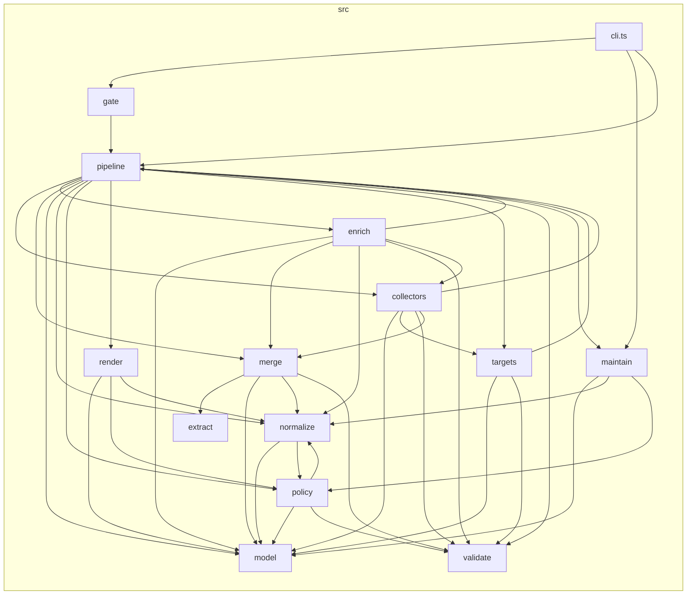

# Module dependencies

This page is for a contributor, someone changing the tool itself. It describes
how the folders under `src/` depend on one another, the layering that keeps the
graph tractable, and the proposed rules that check it. The companion
[architecture](architecture.md) page covers what each stage does; this one is
only about who imports whom.

## The layers

Read the folders bottom-up. Each layer may import the ones below it, never the
ones above.

- **Foundation — `model`, `validate`, `extract`.** The canonical
  [data model](data-model.md), the validation primitives, and the small text
  extractors. They import nothing else under `src/`, so everything can depend on
  them freely.
- **`normalize` and `policy`.** `normalize` maps raw generator output to
  [SPDX](../glossary.md#spdx); `policy` evaluates the normalized model against
  the [policy lanes](../glossary.md#policy-lanes). Both build on the foundation.
- **Collection — `collectors`, `targets`.** These gather raw package inventory
  from lockfiles, manifests, and images. Collection sits *below* policy and
  render: it cannot depend on how a finding is later judged or printed.
- **`merge` and `enrich`.** Merge folds every collector's output into one
  purl-keyed model; enrich annotates it (license resolution, assessments).
- **`render`.** Turns the already-evaluated model into the output documents. It
  consumes `model`, `policy`, and `normalize` and never reaches back into a
  collector.
- **`pipeline`.** The orchestrator. It wires every layer together and so may
  depend on all of them.
- **`cli`.** The entry point; it drives `pipeline`, the gate, and the
  maintenance commands.

A few cross-cutting helpers — artifact paths and a log-sanitizer — live under
`pipeline/` and are imported from several layers. That is why some folder-level
arrows point back into `pipeline` even though the orchestrator itself sits on
top; at the module level those are calls into leaf utilities, not into the
orchestration code.

## The graph

A directory-level snapshot, own code only, collapsed to one node per top-level
folder. It is generated, not hand-drawn, and goes stale as the code moves —
regenerate it with `task arch:graph`.



## The rules

The rules live in `.dependency-cruiser.cjs` at the repository root. They are
proposed governance, not part of the blocking gate — run them by hand with
`task arch:check`. Adopt them by raising the severities to error and wiring the
task into `check` once the tree passes clean.

- **no-circular** (warn) — no dependency cycles between modules.
- **no-orphans** (warn) — no modules imported by nothing (the CLI entry point
  and declaration files are exempt).
- **not-to-test** (error) — production code under `src/` must never import from
  `test/`.
- **not-to-unresolvable** (error) — no dangling or misspelled import paths.
- **no-deprecated-core** (error) — no dependence on deprecated Node core
  modules.
- **foundation-is-dependency-free** (error) — `model` and `validate` must not
  import any other own-code layer.
- **collectors-below-policy-and-render** (error) — `collectors` must not import
  `policy` or `render`.
- **render-consumes-not-collects** (error) — `render` must not import
  `collectors`, `enrich`, `merge`, or `targets`.

## Cycles today

`no-circular` is set to warn, not error, because the tree still has cycles to
untangle. dependency-cruiser reports seven; under this toolchain it counts
type-only imports as edges and cannot tell them apart, so most of the seven are
harmless: they close through an `import type`, which TypeScript erases at
compile time, and so are not runtime cycles.

One is real. At runtime these four modules import one another in a loop:

```
policy/schema.ts        --statedLicense-->      policy/justificationValidity.ts
policy/justificationValidity.ts --accountsFor--> normalize/normalize.ts
normalize/normalize.ts  --matchesPackage-->      policy/packageMatch.ts
policy/packageMatch.ts  --EVERYWHERE_SCOPE-->    policy/schema.ts
```

Every edge is a value import, so the cycle survives compilation. It couples
`policy` and `normalize` into a single unit that can only be understood and
changed together. Breaking it — for example, by moving `EVERYWHERE_SCOPE` or
`statedLicense` to a leaf both sides can import — is the prerequisite for
raising `no-circular` to error and adding `arch:check` to the gate.

## Running the checks

```sh
task arch:check   # validate src/ against the rules above
task arch:graph   # print the directory graph as Mermaid text
```

Both invoke dependency-cruiser through `bunx` at a pinned version. It is kept
out of `package.json` on purpose: adding it as a dependency would pull its
transitive tree into the tool's own license inventory. It borrows the
`typescript` already installed for typechecking, found through `NODE_PATH`.
