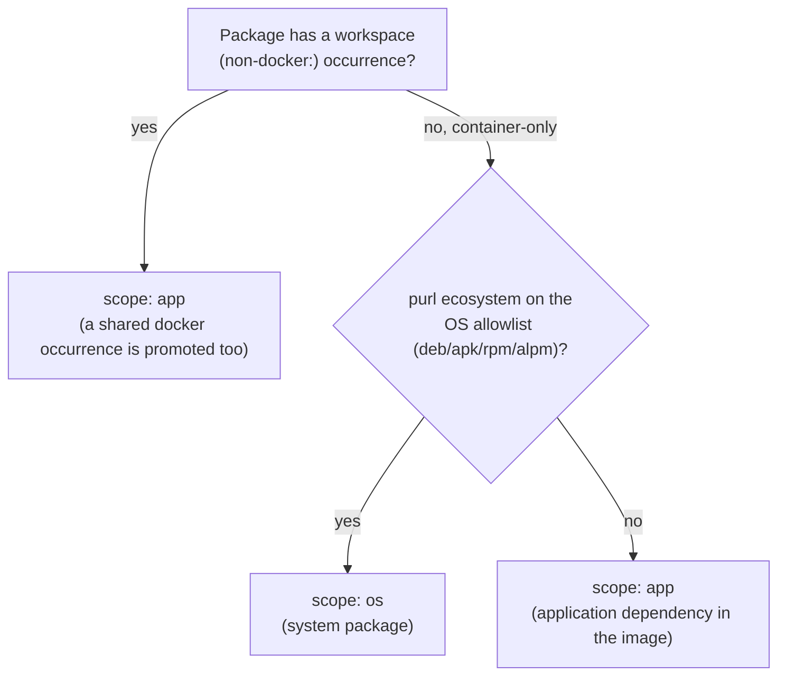

# Dependency classification

This page is for the classification engine — `src/merge/merge.ts`,
`src/pipeline/containerScope.ts`, `src/policy/evaluate.ts` — and anyone
changing it. It is the normative [scope](../glossary.md#scope-app-and-os) and
[verdict](../glossary.md#verdict) decision tree: for any
[package entry](../glossary.md#package-entry), what kind of package it is and
what policy decides about it. The engine and its tests follow this page; a
behavior change to any of them updates this page in the same commit. Each
path in the Path index below is verified one-to-one by
`test/reportPlacement.test.ts`, alongside its markdown-placement counterpart
in [report-placement.md](./report-placement.md).

Classification never decides which document, or which section of one, a
package appears in — that is placement, an output-format concern layered on
top. This page covers only scope and verdict; the markdown report's
placement rules built on this classification live in
[report-placement.md](./report-placement.md), and a future output format
would define its own placement page against this same classification tree.

Classification is two questions, asked in order: what kind of package is this
([scope](../glossary.md#scope-app-and-os)), and what does policy say about it
(a [verdict](../glossary.md#verdict)). This page answers each in turn, then
closes with the invariants that must hold regardless.

## Stage 1 — classification

Every package gets a scope, `app` or `os`. Every docker occurrence
independently gets a development marker. Two questions decide scope; a third,
unrelated one decides the marker.

- **Does the package have a workspace (non-`docker:`) occurrence?**
  - Yes → scope `app`. If the same [purl](../glossary.md#purl) is *also* found
    baked into an image, the merge promotes that docker occurrence to `app`
    too, even though the docker collector stamps every docker input `os` at
    intake — app always wins over os on a shared purl.
  - No (every occurrence is a docker occurrence) → the purl's ecosystem
    decides:
    - Ecosystem on the OS allowlist (`deb`, `apk`, `rpm`, `alpm`) → scope
      `os`, a system package.
    - Any other ecosystem, recognized or not → scope `app`, an application
      dependency an application layer installed into the image. An
      unrecognized ecosystem lands here too: the allowlist fails safe.

- **Is a docker occurrence's container marked `[[docker.development]]`?** This
  sets that occurrence's development marker (`isDevDependency: true`) — but
  only on a package that ends up scope `app`: a re-scoped application-ecosystem
  package, or a package shared with a workspace. A genuine system package
  (stays `os`) is never development-marked, whatever its container's
  classification; `[os_dependencies]` (Stage 2) is its only downgrade lever. A
  workspace occurrence's development marker comes from its own lockfile or
  manifest signal instead, unrelated to any container.

The `docker:` occurrence-identity namespace is merge-reserved: a workspace
target that would mint one fails the run instead of silently colliding with it.

Source: `src/merge/merge.ts` (`mergeInto`, `assertNotReservedIdentity`),
`src/pipeline/pipeline.ts` (`readCommittedDockerSbom`),
`src/pipeline/containerScope.ts` (`applyContainerScopes`),
`src/policy/osEcosystems.ts` (`OS_PACKAGE_ECOSYSTEMS`).

## Stage 2 — verdict routing

The policy engine decides one verdict per (package × occurrence). Precedence,
highest to lowest:

1. **Deny** — a `[[deny]]` match, or a shipped source-available default: fail,
   unless the consumer exempted that exact license via
   `[[allow_source_available]]` (then a warn instead). Terminal: nothing below
   can license a denied finding back in.
2. **A stale override** — an override's precondition no longer matches what's
   observed: fail.
3. **An assessment conflict** — the in-depth scan disagrees with the
   declared/registry quick check: fail. This is the sole trigger for the
   assessment-conflicts surface, independent of everything that follows.
4. **A `[[compatible]]` package or license rule** — ok. (`[[clarify]]` isn't a
   tier of its own here: it rewrites the finding *before* this precedence walk
   runs, so a clarified package falls through the same lanes as any other
   finding. One that clears every lane below cites `clarify[i]` at the
   default-ok tier instead of a bare `default:ok`.)
5. **The copyleft lane** — entered only when the elected SPDX branch is
   copyleft. The tree below.
6. **The imprecise-family lane** — entered when the finding names only a
   family, with no elected expression.
7. **The unknown lane** — entered when the finding has no expression and isn't
   imprecise: follows `[unknown]` handling (`warn` or `fail`).
8. **Default: ok.**

### The copyleft lane

- A family-justified workspace copyleft suppression (the occurrence sits under
  the suppressed path, and the elected copyleft is absorbed by that
  workspace's own declared license family) → `suppressed`. Checked *before*
  the AGPL check below, ahead of every scope — in practice this only matters
  for a workspace-identity occurrence, since a suppression path is authored
  against workspace paths, not `docker:` ones.
- Otherwise, scope `os` and the elected expression carries an AGPL leaf → fail
  `default:agpl-container`, checked before the os downgrade so
  `[os_dependencies]` can never soften it. The practical accept path is a
  `[[compatible]]` rule (tier 4 above — it never even reaches this lane); that
  acceptance is recorded and surfaced by the output layer — see
  [report-placement.md](./report-placement.md) for the markdown report's
  accepted-AGPL notice.
- Otherwise, scope `os`, any other copyleft → would-be fail
  `default:copyleft`, then `[os_dependencies]`: `fail` stays fail, `warn`
  downgrades to warn with the rule id preserved, `ignore` downgrades to ok.
- Otherwise, scope `app` → fail `default:copyleft`; a development occurrence
  then downgrades per `[dev_dependencies]` (`warn`, `ignore`, or stays `fail`).

### The imprecise-family lane

- Scope `os` and the family is the bare `AGPL` token → fail
  `default:agpl-container` (the same escalation as the precise case).
- Family is a could-be-copyleft token (bare `GPL`, `AGPL`, `LGPL`) → warn
  `default:imprecise-copyleft`.
- Any other family (a known-permissive one like bare `BSD`) → warn
  `default:imprecise`.

### The unknown lane

Follows `[unknown]` handling; a `fail` result applies the same os/development
downgrades as the copyleft default does.

Source: `src/policy/evaluate.ts` (`verdictFor`, `copyleftVerdict`,
`impreciseVerdict`, `unknownVerdict`, `acceptedContainerNotices`),
`src/policy/copyleft.ts` (`AGPL_IDS`).

## Invariants

- Deny is terminal.
- An unrecognized purl ecosystem gates as an application dependency — the OS
  allowlist fails safe.
- An AGPL obligation is never silently softened at the verdict level: the
  container AGPL escalation (`default:agpl-container`) bypasses both
  `[os_dependencies]` and `[dev_dependencies]`; only an explicit
  `[[compatible]]` rule can change the verdict.

## Path index (verified end to end)

The same 24 paths as
[report-placement.md](./report-placement.md#path-index-verified-end-to-end),
one row each, stating the Stage-1/Stage-2 outcome (scope, verdict status,
rule) instead of the markdown destination — the two tables share one slug
set, verified by the same suite (`test/reportPlacement.test.ts`). A shared
classification with an unremarkable outcome still gets its own row; the
tables are about slug coverage, not about every classification being unique.

| id | given | classification |
| --- | --- | --- |
| `workspace-prod-permissive` | npm workspace prod dependency, permissive license | `app · ok · default:ok` |
| `workspace-dev-only` | npm workspace dependency, every occurrence dev | `app · ok · default:ok` |
| `shared-workspace-and-container` | npm dependency in a workspace AND baked into a prod container | `app · ok · default:ok` |
| `container-only-system` | apk/deb package, container-only | `os · ok · default:ok` |
| `container-only-app-ecosystem` | npm package baked into a prod container, permissive, container-only | `app · ok · default:ok` |
| `unrecognized-ecosystem-gates` | unrecognized purl ecosystem, copyleft, in a prod container | `app · fail · default:copyleft` |
| `system-copyleft-os-warn` | apk GPL-2.0-only, `os_dependencies = "warn"` | `os · warn · default:copyleft` |
| `system-copyleft-os-fail` | same, `os_dependencies = "fail"` | `os · fail · default:copyleft` |
| `system-copyleft-os-ignore` | same, `os_dependencies = "ignore"` | `os · ok · default:copyleft` |
| `system-agpl-escalates` | apk AGPL-3.0-only, `os_dependencies = "warn"` | `os · fail · default:agpl-container` |
| `system-agpl-accepted-notice` | same, accepted via `[[compatible]]` | `os · ok · compatible[0]` |
| `system-agpl-imprecise-escalates` | imprecise bare-`AGPL` system package | `os · fail · default:agpl-container` |
| `system-agpl-imprecise-accepted` | same, accepted | `os · ok · compatible[0]` |
| `mixed-agpl-fail-and-accept` | one AGPL system purl, failing in one container, accepted in another | `os · fail · default:agpl-container` |
| `app-copyleft-prod-container` | golang/npm copyleft baked into a prod container | `app · fail · default:copyleft` |
| `app-copyleft-dev-container` | app-ecosystem copyleft in a `[[docker.development]]` container | `app · warn · default:copyleft` |
| `app-copyleft-workspace-dev` | workspace dev-dependency copyleft | `app · warn · default:copyleft` |
| `problematic-dedup-keeps-inventory` | workspace prod copyleft, fails | `app · fail · default:copyleft` |
| `imprecise-copyleft-family-only-imprecise` | bare `GPL` app package | `app · warn · default:imprecise-copyleft` |
| `imprecise-permissive-family` | bare `BSD` app package | `app · warn · default:imprecise` |
| `unknown-license-counted` | [unknown] handling = "warn", no license | `app · warn · default:unknown` |
| `suppressed-workspace-copyleft` | family-justified `[[workspace.copyleft_suppressed]]` | `app · suppressed · workspace.copyleft_suppressed[0]` |
| `denied-license-terminal` | a `[[deny]]` match with a `[[compatible]]` rule that would otherwise accept it | `app · fail · denied[0]` |
| `system-package-in-dev-container-counts-dev` | apk permissive package whose only container is dev-marked | `os · ok · default:ok` |
