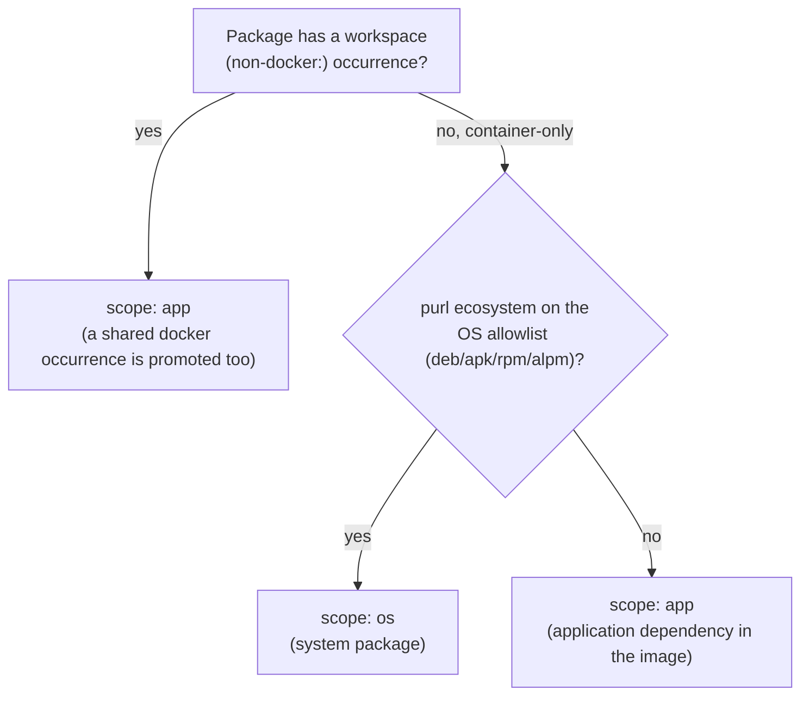

# Report placement

This page is for the renderer, the policy engine, and anyone changing either. It
is the normative placement specification for `THIRD_PARTY_LICENSES.md` — for any
[package entry](../glossary.md#package-entry), exactly where its row lands and
why. `src/render/markdown.ts`, the policy engine's section-relevant routing, and
the placement tests all follow it; a behavior change to any of them updates this
page in the same commit.

Placement is three questions, asked in order: what kind of package is this
([scope](../glossary.md#scope-app-and-os)), what does policy say about it (a
[verdict](../glossary.md#verdict)), and which section does that scope and
verdict route it to. This page answers each in turn, then closes with the
invariants that must hold regardless.

## Stage 1 — classification

Every package gets a scope, `app` or `os`. Every docker occurrence
independently gets a development marker. Two questions decide scope; a third,
unrelated one decides the marker.

- **Does the package have a workspace (non-`docker:`) occurrence?**
  - Yes → scope `app`. If the same [purl](../glossary.md#purl) is *also* found
    baked into an image, the merge promotes that docker occurrence to `app`
    too, even though the docker collector stamps every docker input `os` at
    intake — app always wins over os on a shared purl.
  - No (every occurrence is a docker occurrence) → the purl's ecosystem
    decides:
    - Ecosystem on the OS allowlist (`deb`, `apk`, `rpm`, `alpm`) → scope
      `os`, a system package.
    - Any other ecosystem, recognized or not → scope `app`, an application
      dependency an application layer installed into the image. An
      unrecognized ecosystem lands here too: the allowlist fails safe.

- **Is a docker occurrence's container marked `[[docker.development]]`?** This
  sets that occurrence's development marker (`isDevDependency: true`) — but
  only on a package that ends up scope `app`: a re-scoped application-ecosystem
  package, or a package shared with a workspace. A genuine system package
  (stays `os`) is never development-marked, whatever its container's
  classification; `[os_dependencies]` (Stage 2) is its only downgrade lever. A
  workspace occurrence's development marker comes from its own lockfile or
  manifest signal instead, unrelated to any container.

The `docker:` occurrence-identity namespace is merge-reserved: a workspace
target that would mint one fails the run instead of silently colliding with it.

Source: `src/merge/merge.ts` (`mergeInto`, `assertNotReservedIdentity`),
`src/pipeline/pipeline.ts` (`readCommittedDockerSbom`),
`src/pipeline/containerScope.ts` (`applyContainerScopes`),
`src/policy/osEcosystems.ts` (`OS_PACKAGE_ECOSYSTEMS`).

## Stage 2 — verdict routing

The policy engine decides one verdict per (package × occurrence). Precedence,
highest to lowest:

1. **Deny** — a `[[deny]]` match, or a shipped source-available default: fail,
   unless the consumer exempted that exact license via
   `[[allow_source_available]]` (then a warn instead). Terminal: nothing below
   can license a denied finding back in.
2. **A stale override** — an override's precondition no longer matches what's
   observed: fail.
3. **An assessment conflict** — the in-depth scan disagrees with the
   declared/registry quick check: fail. This is the sole trigger for the
   Assessment conflicts section below, independent of everything that follows.
4. **A `[[compatible]]` package or license rule** — ok. (`[[clarify]]` isn't a
   tier of its own here: it rewrites the finding *before* this precedence walk
   runs, so a clarified package falls through the same lanes as any other
   finding. One that clears every lane below cites `clarify[i]` at the
   default-ok tier instead of a bare `default:ok`.)
5. **The copyleft lane** — entered only when the elected SPDX branch is
   copyleft. The tree below.
6. **The imprecise-family lane** — entered when the finding names only a
   family, with no elected expression.
7. **The unknown lane** — entered when the finding has no expression and isn't
   imprecise: follows `[unknown]` handling (`warn` or `fail`).
8. **Default: ok.**

### The copyleft lane

- A family-justified workspace copyleft suppression (the occurrence sits under
  the suppressed path, and the elected copyleft is absorbed by that
  workspace's own declared license family) → `suppressed`. Checked *before*
  the AGPL check below, ahead of every scope — in practice this only matters
  for a workspace-identity occurrence, since a suppression path is authored
  against workspace paths, not `docker:` ones.
- Otherwise, scope `os` and the elected expression carries an AGPL leaf → fail
  `default:agpl-container`, checked before the os downgrade so
  `[os_dependencies]` can never soften it. The practical accept path is a
  `[[compatible]]` rule (tier 4 above — it never even reaches this lane); that
  acceptance records an accepted-container notice (Stage 3).
- Otherwise, scope `os`, any other copyleft → would-be fail
  `default:copyleft`, then `[os_dependencies]`: `fail` stays fail, `warn`
  downgrades to warn with the rule id preserved, `ignore` downgrades to ok.
- Otherwise, scope `app` → fail `default:copyleft`; a development occurrence
  then downgrades per `[dev_dependencies]` (`warn`, `ignore`, or stays `fail`).

### The imprecise-family lane

- Scope `os` and the family is the bare `AGPL` token → fail
  `default:agpl-container` (the same escalation as the precise case).
- Family is a could-be-copyleft token (bare `GPL`, `AGPL`, `LGPL`) → warn
  `default:imprecise-copyleft`.
- Any other family (a known-permissive one like bare `BSD`) → warn
  `default:imprecise`.

### The unknown lane

Follows `[unknown]` handling; a `fail` result applies the same os/development
downgrades as the copyleft default does.

Source: `src/policy/evaluate.ts` (`verdictFor`, `copyleftVerdict`,
`impreciseVerdict`, `unknownVerdict`, `acceptedContainerNotices`),
`src/policy/copyleft.ts` (`AGPL_IDS`).

## Stage 3 — section placement

`renderMarkdown` places every package into two different kinds of section, in
this fixed order: package counts, Problematic licenses (policy run only),
Copyleft and special notices (policy run only), Imprecise licenses, Assessment
conflicts, Containers, Production dependencies, Development-only dependencies.
See [output-format.md](./output-format.md) for what each column means; this
page states only where a package lands.

### Narrative sections (verdict- or finding-driven, deduped)

- **Problematic licenses** — every `fail` verdict, grouped by (purl, rule,
  reason). Takes precedence over the whole Copyleft and special notices
  section below: a purl carrying a fail anywhere never rows in that section's
  flagged table, and never appears in its accepted-notice list either.
- **Copyleft and special notices** — three independent parts:
  - The suppressed-workspaces list, shown whenever policy configures any,
    whether or not it currently suppresses anything.
  - Accepted-AGPL container notices: a scope-`os` package whose AGPL
    obligation (a precise leaf, or the imprecise `AGPL` token) was accepted
    through a `[[compatible]]` rule at some occurrence, excluded when the
    purl also carries a fail elsewhere.
  - Flagged rows: scope is not `os`, the purl isn't already in Problematic,
    and it carries at least one fail or warn verdict whose rule is *exactly*
    `default:copyleft` — an imprecise-copyleft warn never qualifies here, only
    in Imprecise licenses below.

  A system package's non-AGPL copyleft never rows here — it's routine, and
  excluded by scope alone, regardless of its verdict. Acceptance via
  `[[compatible]]` keeps a package out of the flagged rows for every
  ecosystem and scope, because an accepted occurrence never reaches the
  copyleft lane at all (Stage 2, tier 4 decides first); the accepted-notice
  mechanism above exists only for the one case that would otherwise fail
  unconditionally, the container-system AGPL escalation.
- **Imprecise licenses** — every package whose finding is imprecise,
  unconditionally, independent of its verdict. This overlaps the sections
  above by design: a bare-`AGPL` system package that fails
  `default:agpl-container` still rows here too.
- **Assessment conflicts** — every package whose finding carries a conflict
  marker, unconditionally. Exempt from the Problematic dedup: a package here
  also rows in Problematic, since a conflict is always a fail.

### Inventory sections (placement-driven, complete — nothing is ever dropped)

- **Containers** — a thin index of every analyzed container (one row per
  distinct `docker:<source>` occurrence target), classified `production` or
  `development` by the `[[docker.development]]` globs.
- **Production dependencies** — the app table (every package with a workspace
  occurrence that isn't
  [development-only](../glossary.md#development-only-and-production)) plus one
  `### Container: docker:<source>` subsection per container *not* marked
  development.
- **Development-only dependencies** — the app table (every occurrence
  development) plus one container subsection per container marked
  development.
- **Container subsection** — every package with a docker occurrence in that
  container, with no exclusion — a Problematic-escalated package still rows
  here. Split into a System packages table (the OS allowlist) and an
  Application packages table (everything else), each sorted the same way as
  the inventory tables; an empty half is omitted.
- A package shared with a workspace rows in *both* its app table and each
  container subsection it occurs in — a complete inventory, not an exclusive
  choice.

### Counts

- Total: every package entry.
- One line per ecosystem, sorted by name.
- Production + Development-only = Total, a two-way partition. This pair uses
  its own placement predicate, not the app-table split directly: a package
  counts development-only when it has no occurrence in a production-classified
  container *and* is either a pure-container package or has every occurrence
  marked development. That second clause is what lets a system package —
  never development-marked itself, per Stage 1 — still count development-only
  when its only container is `[[docker.development]]`-marked.
- Container packages (any docker occurrence) and Unknown license are
  cross-cutting subtotals, not a third slice of the partition — a package can
  be counted in either in addition to its Production or Development-only
  bucket.

Source: `src/render/markdown.ts` (`renderMarkdown` and its section-lines
helpers).

## Invariants

- Every package has exactly one Production/Development-only classification.
- A purl in Problematic never rows in Copyleft, but keeps its inventory row
  and its Assessment-conflicts row when it carries a conflict marker.
- An AGPL obligation is always visible: a fail routes to Problematic, an
  accepted system AGPL routes to a special notice, and it is never silently
  absent.
- Routine system copyleft (anything but AGPL) appears only under its
  container, never in the Copyleft section.
- Deny is terminal.
- An unrecognized purl ecosystem gates as an application dependency — the OS
  allowlist fails safe.
- The report is byte-deterministic: fixed section order, stable sorts
  throughout.
